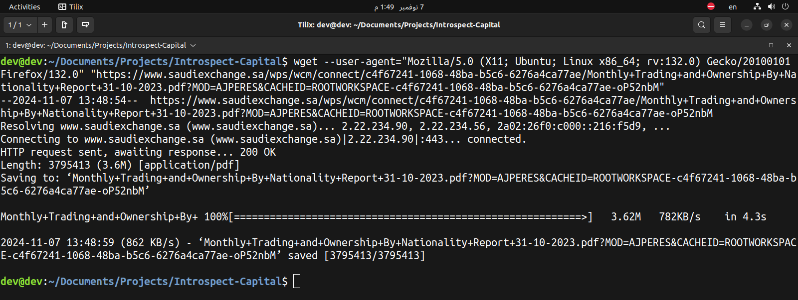
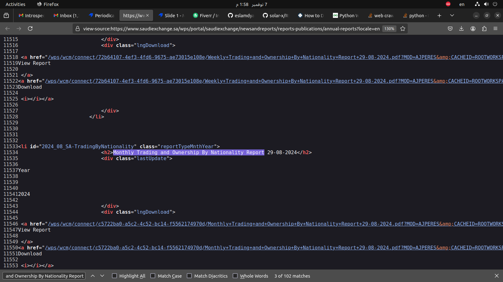
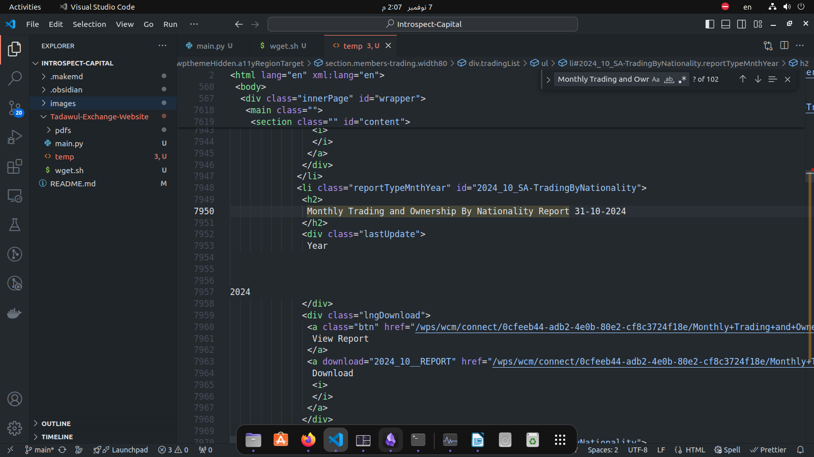
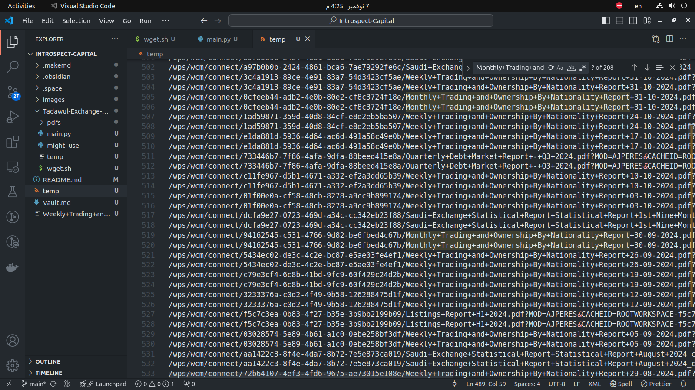
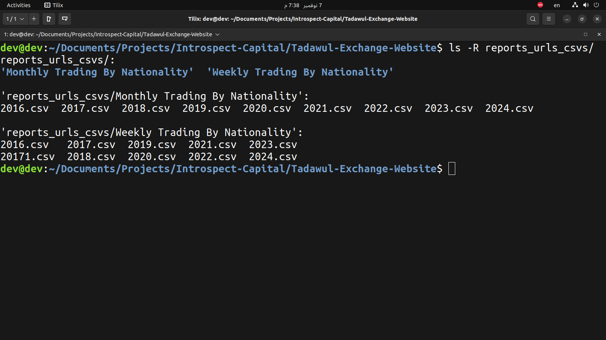
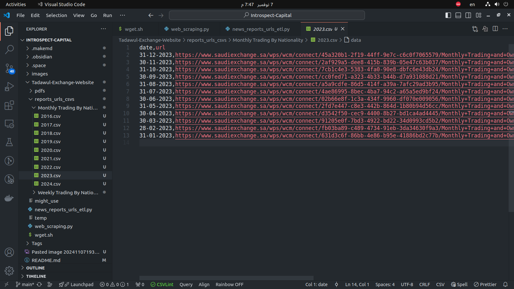
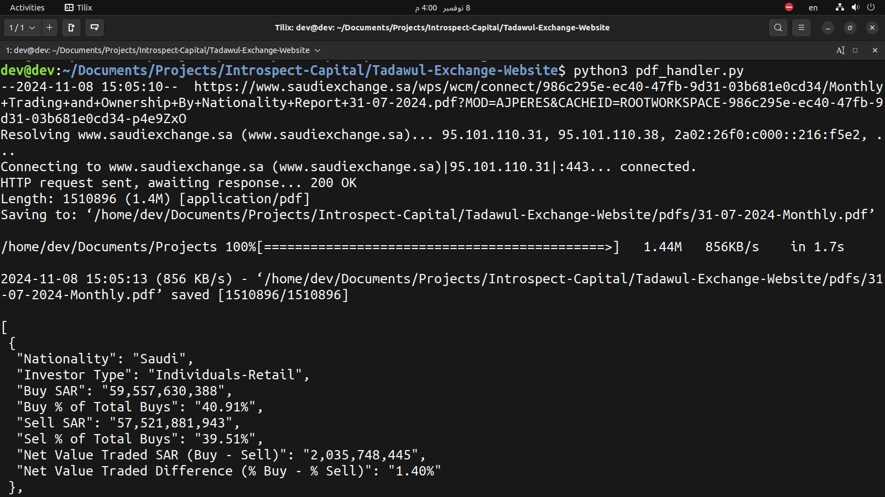
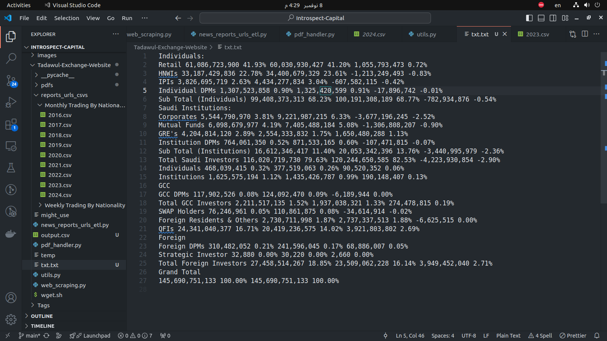

# Introspect-Capital
Introspect Capital Tasks for the technical interview


## Tadawul-Exchange-Website
Extract and save data from Tadawul Exchange website's monthly reports  with a specific focus on 'Trading by Nationality.

<br/>

#### To download the pdf file from the website
- Using `wget`

```bash
 wget --user-agent="Mozilla/5.0 (X11; Ubuntu; Linux x86_64; rv:132.0) Gecko/20100101 Firefox/132.0" "https://www.saudiexchange.sa/wps/wcm/connect/c4f67241-1068-48ba-b5c6-6276a4ca77ae/Monthly+Trading+and+Ownership+By+Nationality+Report+31-10-2023.pdf?MOD=AJPERES&CACHEID=ROOTWORKSPACE-c4f67241-1068-48ba-b5c6-6276a4ca77ae-oP52nbM"
```

Here is an example from getting the `2023_10__REPORT.pdf` report when filtering by  `Nationality`.

<br/>

Note that for this website we need to add the `user-agent` to the request.


<br/>

> Now we just need to add this command into a bash script and call it from a python script with the desired monthly date, but first to get the date we need to parse the page content to get all the available dates.


<br/>

#### Parsing the page source with python 
reports_urls_csvs/- The idea is to get only the lines with `Monthly Trading and Ownership By Nationality Report`


<br/>

- And here is the page after outputting the page to a tmp file

```bash
python3 main.py > temp
```

<br/>




Or we just can take the `herf` directly from here.


##### Parsing the page source with python 
After parsing the `temp` file with `news_reports_urls_etl.py` script , displayed is two directories one for `weekly` and another for `monthly` both filtered by `naionality`.



Each file contains the date with the url for all available pdfs within that category.

- Example for year 2023, Monthly, and Trading By Nationality.


<br/>

> Those csv files will be later used with the input from the user, which year ? which type ? ....

<br/>

##### Parsing the pdf table data with python 
The `pdf_handler.py` with the help of `parse_pdf_page` function in `utils.py` file do the following:
- Take desired report, its date, year and type
- Get its url from previously saved csvs file and download it if we didn't download it before
- Parse the table content of page 5 and 6 of the pdf report and convert it to csv file



<br/>

A look into the row lines output from the `pdfplumber` library
