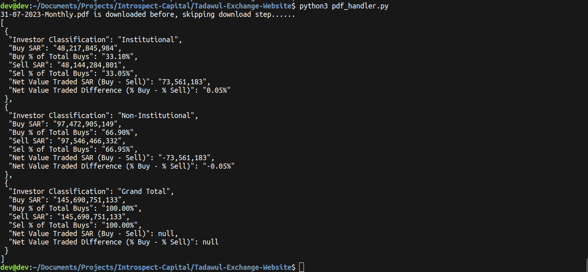
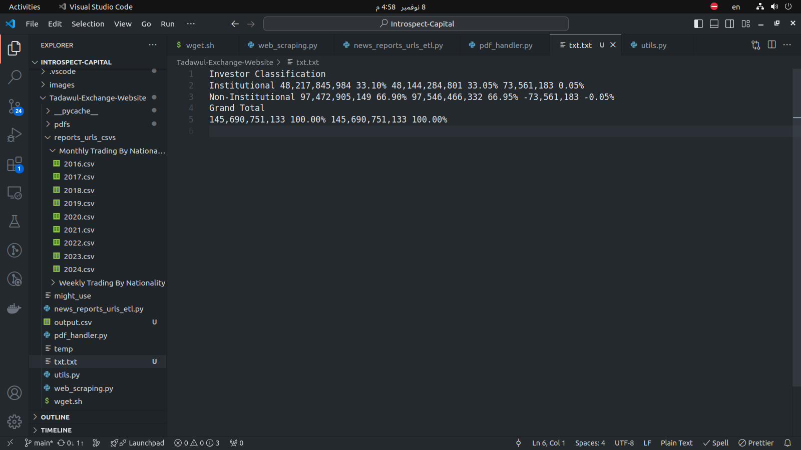
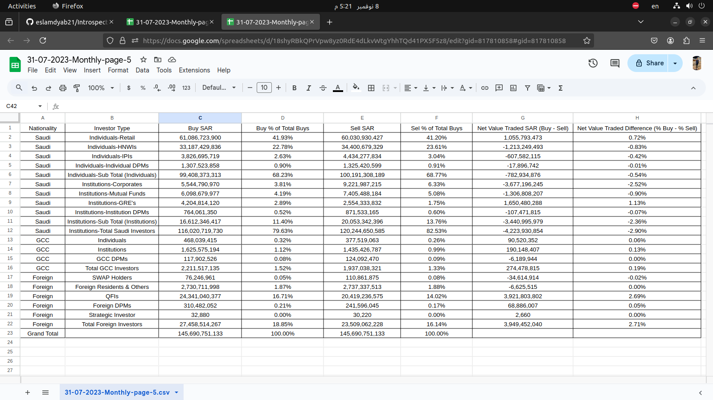
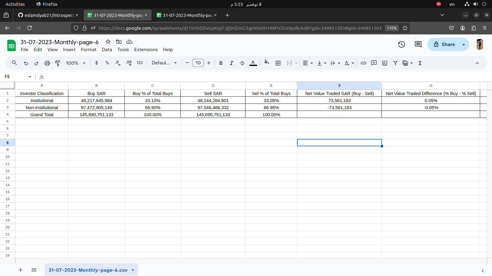
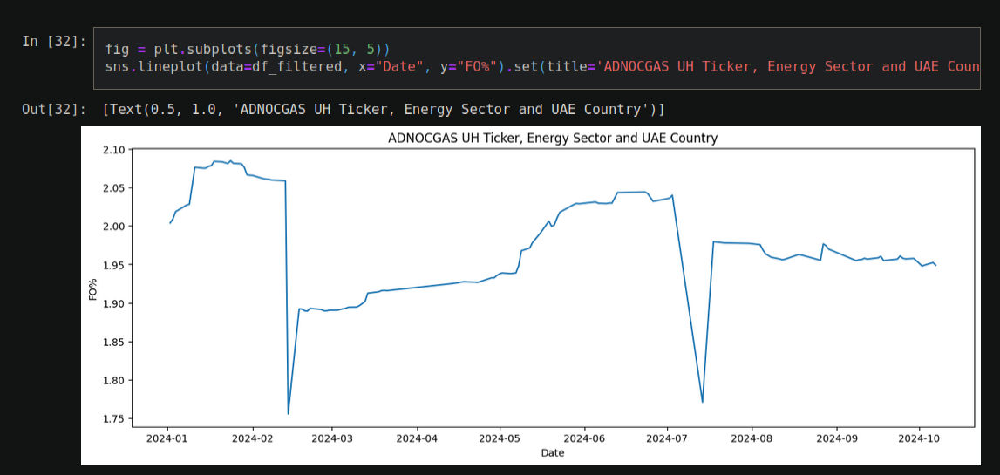
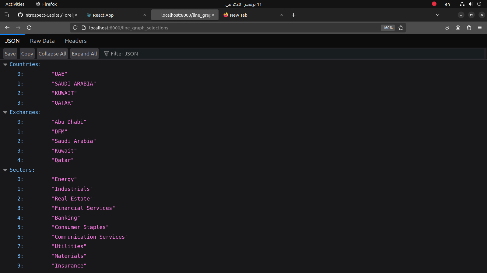
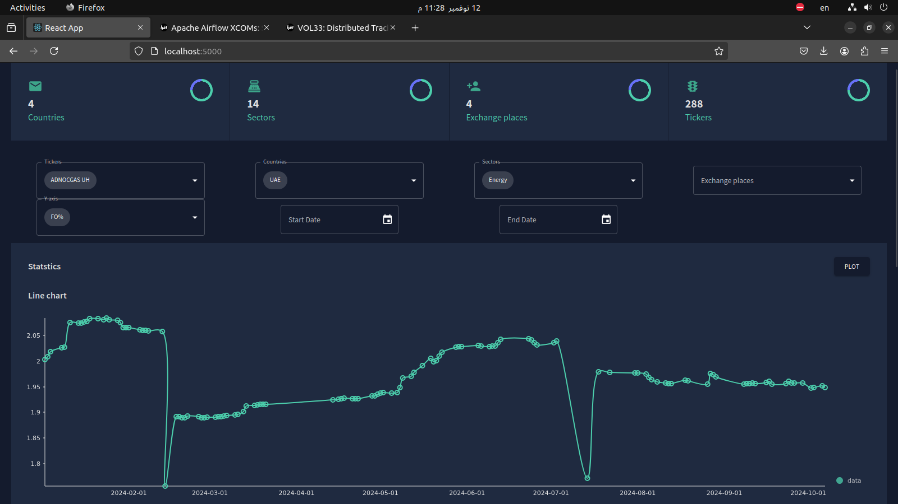
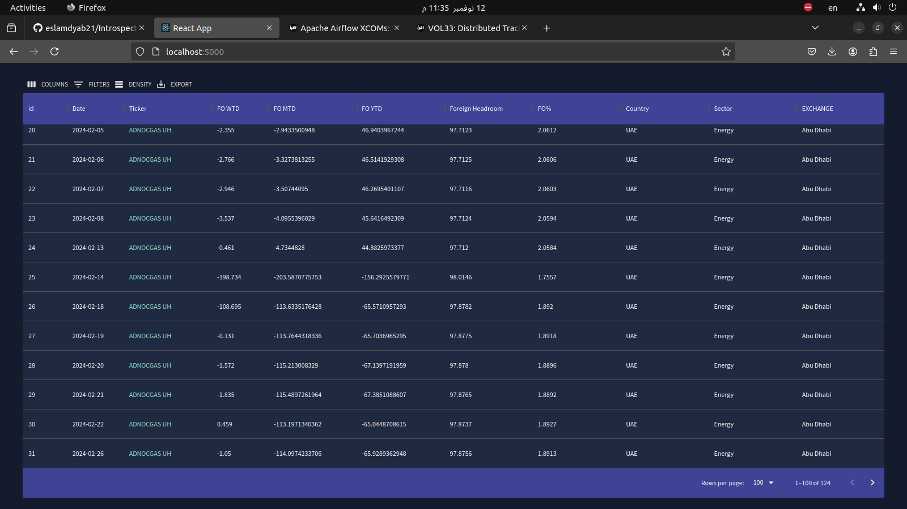

# Introspect-Capital
Introspect Capital Tasks for the technical interview


## Tadawul-Exchange-Website
Extract and save data from Tadawul Exchange website's monthly reports  with a specific focus on 'Trading by Nationality.

<br/>

#### To download the pdf file from the website
- Using `wget`

```bash
 wget --user-agent="Mozilla/5.0 (X11; Ubuntu; Linux x86_64; rv:132.0) Gecko/20100101 Firefox/132.0" "https://www.saudiexchange.sa/wps/wcm/connect/c4f67241-1068-48ba-b5c6-6276a4ca77ae/Monthly+Trading+and+Ownership+By+Nationality+Report+31-10-2023.pdf?MOD=AJPERES&CACHEID=ROOTWORKSPACE-c4f67241-1068-48ba-b5c6-6276a4ca77ae-oP52nbM"
```

Here is an example from getting the `2023_10__REPORT.pdf` report when filtering by  `Nationality`.

<br/>

Note that for this website we need to add the `user-agent` to the request.


<br/>

> Now we just need to add this command into a bash script and call it from a python script with the desired monthly date, but first to get the date we need to parse the page content to get all the available dates.


<br/>

#### Parsing the page source with python 
reports_urls_csvs/- The idea is to get only the lines with `Monthly Trading and Ownership By Nationality Report`


<br/>

- And here is the page after outputting the page to a tmp file

```bash
python3 main.py > temp
```

<br/>


Or we just can take the `herf` directly from here.


##### Parsing the page source with python 
After parsing the `temp` file with `news_reports_urls_etl.py` script , displayed is two directories one for `weekly` and another for `monthly` both filtered by `naionality`.


Each file contains the date with the url for all available pdfs within that category.

- Example for year 2023, Monthly, and Trading By Nationality.


<br/>

> Those csv files will be later used with the input from the user, which year ? which type ? ....

<br/>

##### Parsing the pdf table data with python 
The `pdf_handler.py` with the help of `parse_pdf_page` function in `utils.py` file do the following:
- Take desired report, its date, year and type
- Get its url from previously saved csvs file and download it if we didn't download it before
- Parse the table content of page 5 and 6 of the pdf report and convert it to csv file




<br/>

A look into the row lines output from the `pdfplumber` library of page 5


<br/>

A look into the row lines output from the `pdfplumber` library of page 6



<br/>

```bash
ls -R final_reports_csvs/
final_reports_csvs/:
31-07-2023-Monthly-page-5.csv  31-07-2023-Monthly-page-6.csv
```

<br/>

Here is the final output csv file of the report of page 5


Here is the final output csv file of the report of page 6



##### Oder of execution
- run `web_scraping.py` to make the `temp` file of all pdfs urls
```bash
python3 web_scraping.py > temp
```

<br/>

- then run `news_reports_urls_etl.py` script to make the `reports_urls_csvs` directory of all years and types
```bash
python3 reports_urls_csvs.py
```

<br/>

- then run `pdf_handler.py` to get input from user, which year and which type, download the pdf file and parse its content and convert it to csv file and save it
```bash
python3 pdf_handler.py
```

<br/>

##### Demo
[t1.webm](https://github.com/user-attachments/assets/50deb5fa-5a65-4952-99c5-04f90462a72a)


<br/>

<br/>

## Foreign-Ownership-Analysis
Build a web-based dashboard to display and analyze data from an Excel file containing financial metrics for various tickers.

- I started by inspecting the two dataframes with jupyter notebooks, you can see it in the `notebook.ipynb`
along with useful insights about the data and wrangling.


- Made a line graph showing `FO%` changes by `ADNOCGAS UH` in Ticker, `Energy` in Sector and `UAE` in Country



<br/>

- Then I started developing a backend api with `flask`, `pandas` in python to filter and retrieve the data for the line graph plot in the frontend, all data related work is inspired by inspecting in the `notebook.ipynb`

- Here is an example of and endpoint `http://localhost:8000/line_graph_selections` which returns all unique values of `Countries, Exchanges, Sectors, Tickers` columns so that we can chose from in the frontend.


<br/>

- Then started to develop the frontend with `react`, the page features a pref summary about the `Countries, Exchanges, Sectors, Tickers` data, select drop-down menu to chose desired filtration, and then the line plot.



<br/>

- Also we can filter by date, and the resulted filtered data is shown in a nice formatted table for reference.


<br/>
<br/>

##### Oder of execution
- run `main.py` in the `Foreign-Ownership-Analysis` directory for the backend, it will run on port 8000.
```bash
python3 main.py
```

<br/>

- then we start the frontend dev environment by running the following command in the `web-dashboard` directory <ater installing react, npm, and its modules> and it will start on port 5000
```bash
npm run start
```

<br/>


##### Demo
[t2.webm](https://github.com/user-attachments/assets/43787360-00c0-4b3f-bbda-0eac32eba191)

